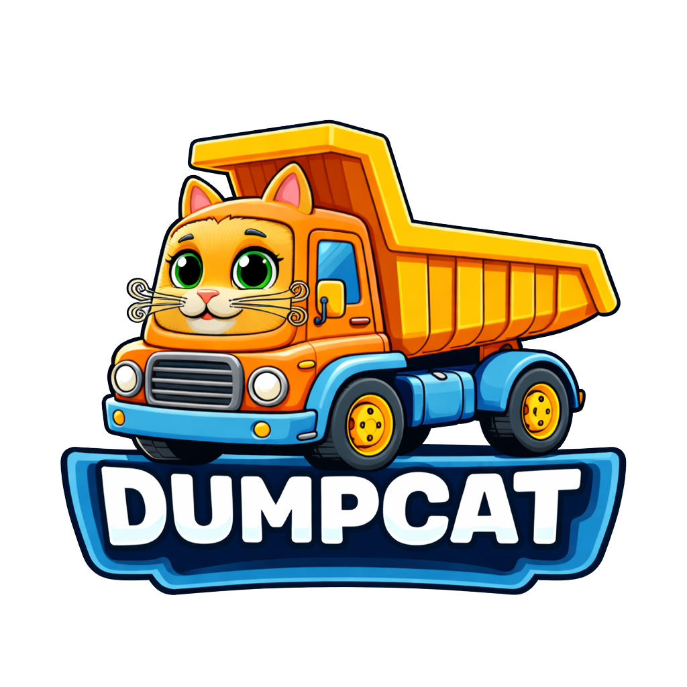

# dumpcat

<p align="center">
  
</p>

[](https://pypi.python.org/pypi/dumpcat)
[](https://pypi.python.org/pypi/dumpcat)

Dump a directory's file tree and contents into a single formatted output — built for LLM prompts.

## Highlights

- **One command** to dump your entire codebase (or a filtered slice of it) into a single output
- **Smart defaults** — respects `.gitignore`, skips binaries, limits file sizes
- **Three output formats** — Markdown, plain text, or JSON
- **Filterable** — by extension, glob pattern, depth, and file size
- **Clipboard ready** — copy output directly with `-c`
- **Prompt-friendly** — prepend/append text or template files for LLM context
- **Configurable** — project-level `.dumpcat.toml` with named profiles
- **Zero bloat** — one runtime dependency (`pathspec`), everything else is stdlib

## Installation

Requires **Python 3.11+**.

```bash
uv tool install dumpcat
```

```bash
# Or with pip
pip install dumpcat
```

```bash
# Or with pipx
pipx install dumpcat
```

## Quick start

```bash
# Dump current directory as Markdown
dumpcat

# Only Python files, 2 levels deep
dumpcat -d 2 -i .py

# Prepend a prompt and copy to clipboard
dumpcat -i .py -c -p "Review this code for security issues"

# Plain text with stats
dumpcat -f plain -s

# Just the tree structure
dumpcat --tree-only

# JSON output for tooling
dumpcat -f json --no-tree
```

## Output

dumpcat renders file contents followed by a file tree:

````
# File Contents

## `src/main.py`

```python
import sys

def main():
    print("hello")
```

# File Tree

```
.
├── src/
│   ├── main.py
│   └── utils/
│       └── helpers.py
└── README.md
```
````

See the [output formats documentation](https://allenfp.github.io/dumpcat/output-formats/) for Markdown, plain text, and JSON examples.

## CLI reference

```
dumpcat [OPTIONS] [PATH]
```

| Flag | Short | Description |
|---|---|---|
| `--output PATH` | `-o` | Write output to a file |
| `--clipboard` | `-c` | Copy output to clipboard |
| `--depth INT` | `-d` | Max directory depth |
| `--include EXT` | `-i` | Include only these extensions (repeatable) |
| `--exclude PATTERN` | `-e` | Exclude glob patterns (repeatable) |
| `--gitignore / --no-gitignore` | | Respect `.gitignore` rules (default: on) |
| `--tree-only` | | Show only the tree, no file contents |
| `--no-tree` | | Show only file contents, no tree |
| `--prepend TEXT` | `-p` | Text or `@filepath` to prepend |
| `--append TEXT` | `-a` | Text or `@filepath` to append |
| `--max-size SIZE` | | Skip files larger than this (default: `1mb`) |
| `--stats` | `-s` | Show file count, lines, and estimated tokens |
| `--format FORMAT` | `-f` | `markdown`, `plain`, or `json` (default: `markdown`) |
| `--config PATH` | | Path to config file |
| `--profile NAME` | | Named profile from config |
| `--follow-symlinks` | | Follow symbolic links |
| `--hidden` | | Include dotfiles and dotdirs |
| `--line-numbers` | `-n` | Add line numbers to file contents |

See the [full CLI reference](https://allenfp.github.io/dumpcat/cli-reference/) for details.

## Configuration

Create a `.dumpcat.toml` in your project root:

```toml
[default]
exclude = ["__pycache__", "*.pyc", ".venv"]

[profiles.python]
include = [".py", ".pyi", ".toml", ".md"]
exclude = ["__pycache__", "*.pyc", ".venv", ".mypy_cache"]

[profiles.web]
include = [".js", ".ts", ".tsx", ".css", ".html"]
exclude = ["node_modules", "dist", ".next"]
```

```bash
dumpcat --profile python
```

See the [configuration documentation](https://allenfp.github.io/dumpcat/configuration/) for details.

## Documentation

Full documentation is available at [allenfp.github.io/dumpcat](https://allenfp.github.io/dumpcat/).

## License

[MIT](LICENSE)
